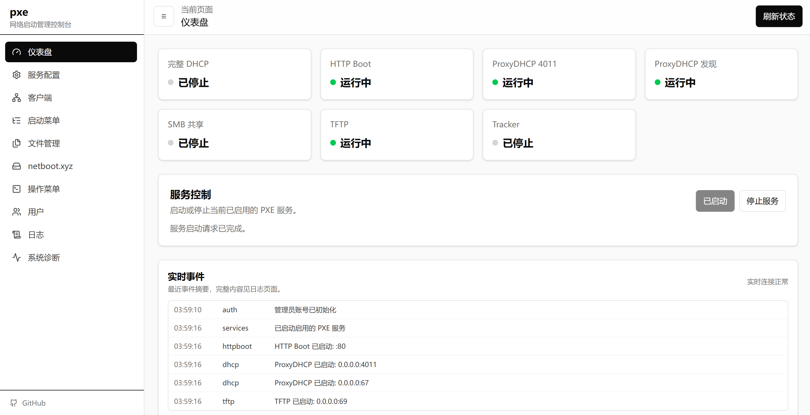
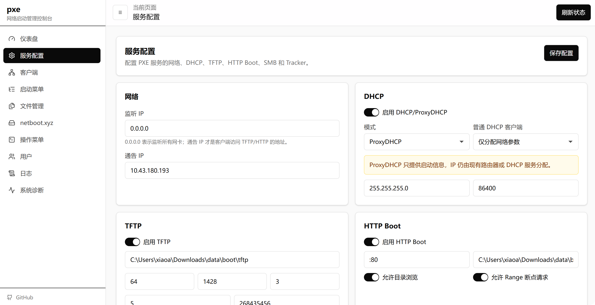

## PXE
> 基于 Go + Vue 3 构建的**跨平台** PXE 网络启动管理服务，轻松实现多系统环境下的开箱即用。

## ✨ 功能特点

* **全平台支持**：采用 Go 语言开发，原生跨平台（Windows / Linux / macOS），无需繁琐的环境配置。
* **Web 可视化管理**：可视化管理界面，实时日志查看和文件工作台。
* **服务一键管控**：在 Web 端即可启动、停止或重启 DHCP (含 ProxyDHCP)、TFTP、HTTP Boot、SMB 和 Torrent 服务。
* **智能网络引导**：
    * **完整 DHCP**：支持标准 DHCP 地址分配及 ProxyDHCP 模式（不影响现有路由）。
    * **自动适配**：智能识别终端架构（BIOS / UEFI / iPXE）并下发引导文件。
    * **内置 netboot.xyz**：支持官方源拉取，同时兼容自定义启动文件。
* **高效协议传输**：提供稳定且带重试机制的 TFTP，以及支持缓存和虚拟路径的 HTTP Boot 服务。
* **在线文件管理**：内置文件工作台，支持 HTTP Boot、TFTP、netboot.xyz 目录浏览、上传、新建、重命名、删除、种子制作和小型文本脚本在线编辑。
* **客户端维护**：支持客户端静态绑定、待认领、Wake-on-LAN 多目标唤醒，以及按服务器平台生成的 Ping/HTTP 检查操作模板。

### windows运行

[Releases](https://github.com/wananle88/netboot/releases)页面下载构建好的二进制文件

下载后解压，双击打开即可运行。

可以不带参数直接启动，默认数据会自动生成在当前路径的data目录。

常用参数（可选项）：
```text
--config     指定 pxe.toml
--data-dir   指定数据目录
--host       覆盖管理端监听主机
--port       覆盖管理端端口
--no-browser 禁止自动打开浏览器
```

启动成功后，会自动打开默认浏览器访问管理面板，如果没有浏览器的场景则不会打开。

### Linux运行
一键脚本
```
curl -fsSL -o netboot.sh https://raw.githubusercontent.com/wananle88/netboot/main/netboot.sh
chmod +x netboot.sh
./netboot.sh
```

默认路径：
- 程序：`/usr/local/bin/pxe`
- 数据：`/opt/netboot/data`
- IPXE固件：`/opt/netboot`
- 服务名称：`netboot`

### Docker
```
docker run -d \
  --name netboot \
  --restart unless-stopped \
  --network host \
  -v $(pwd)/data:/data \
  ghcr.io/wananle88/netboot
```
默认web端口：8088

### 详细文档见 [docs](docs/使用文档.md)

## 界面预览



---


